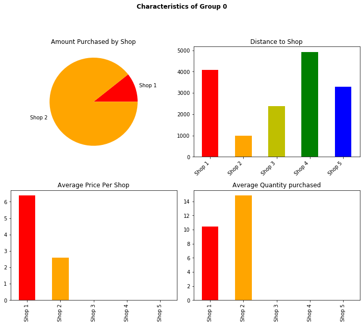
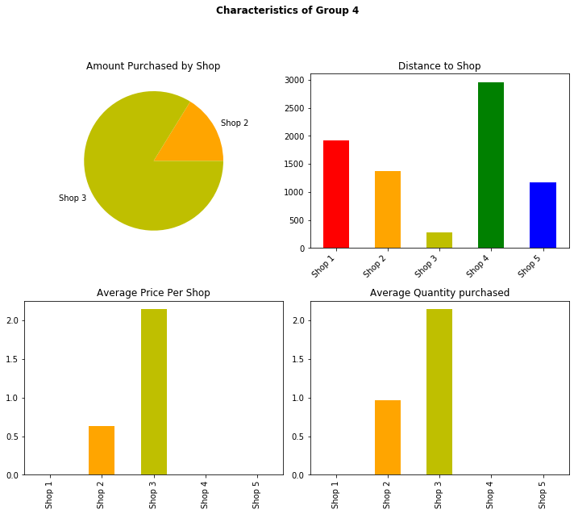
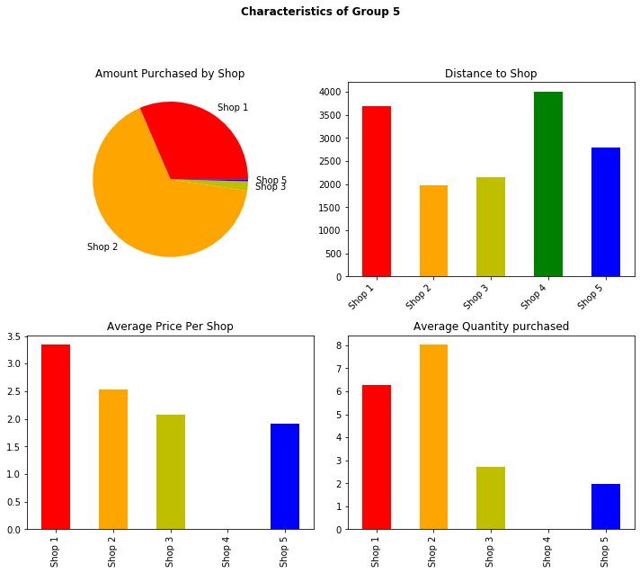

# Customer Segmentation Analysis


## Getting Started

1. Clone this repo (https://github.com/Dantarshi/projectcapstone).

2. Raw Data is being kept (raw_data_clusters.csv) within this repo.

3. main notebook link(https://github.com/Dantarshi/projectcapstone/blob/master/Customer%20Segmentation%20Analysis.ipynb)


## Project Intro/Objective
The purpose of this project is to use customer purchase data to group customers based on their purchase behaviors and
to lay the foundation in the development of a business strategy that will create a target market and improve customer satisfaction. 


## Methods Used
* Inferential Statistics
* Machine Learning
* Data Visualization
* Predictive Modeling
* etc.

## Technologies 
* Python
* Seaborn
* Plotly Express
* Pandas, jupyter
* Scikit-learn
* ipywidget
* KMeans
* etc. 

## Project Description
This project performs analyzis of customer purchase behaviors by revealing the clusters customers fall into and how these clusters interact with the company's shops.
The dataset used in the project is a city retail market data from an Italian distribution company called Coop. The dataset contains data aggregated from customers 
and information from the shops and pivoted to new columns made up of 40 features(coulumns) and 60366 instances(rows).
After importing the data from a csv file, I transformed the data into a dataframe and cleaned it using pandas. A couple of methods were used perform the analysis. 
* PCA for reduction of dimentionality by decomposing and tranforming the features into principal components (PC) and linear variance of the data.
* K-Means clustering is used to find the clusters, it is a fast algorithm mostly used fo customer segmentation especially for numerical data and it does well with large datasets.
* Random Forest Classification is used to train the dataset and identify the most important features.
* Plotly Express, Seaborn and Matplotlib for visualization in 3D.
            
## Needs of this project

- data exploration/descriptive statistics
- data processing/cleaning/Standardization
- statistical modeling
- machine learning modeling
- visualization
- writeup/reporting


## Conclusion

The customer segmentation analysis was directed towards grouping customers based on their purchase behaviors and using those groups to understand their purchase behaviors.

I found out that their are seven groups and the distance of the shops from the customers had influence on the amount and quantity purchased by customers.

I also found out that regardless of the distance from shop 1, customers spend relatively more in shop 1 than any other shop.

The information gotten from this analysis will not only help in minimizing the cost by allocating the right type of inventory to the right shop but can also help to improve customer satisfaction and retension. Offers, deals, discounts etc are some of the techniques we can incorporate in the business strategy.


Research Question: Are they any clusters of customers based on their purchase behavior? 

## Importing and cleaning data

Importing neccessary Libraries


```python
# Importing the neccesarry libraries
import numpy as np 
import pandas as pd
import seaborn as sns
import plotly.express as px
import sklearn.metrics as metrics
import matplotlib.pyplot as plt
%matplotlib inline

from sklearn.preprocessing import StandardScaler, LabelEncoder
from sklearn.model_selection import train_test_split
from sklearn.ensemble import RandomForestClassifier
from sklearn.impute import SimpleImputer
from sklearn.pipeline import Pipeline
from sklearn.decomposition import PCA
from sklearn.cluster import KMeans

from ipywidgets import interact
from mpl_toolkits import mplot3d
```

Importing dataset


```python
# Importing data from excel into the notebook
df = pd.read_excel(r'Capstone.xlsx')
df.head()
```


<div>
<style scoped>
    .dataframe tbody tr th:only-of-type {
        vertical-align: middle;
    }

    .dataframe tbody tr th {
        vertical-align: top;
    }

    .dataframe thead th {
        text-align: right;
    }
</style>
<table border="1" class="dataframe">
  <thead>
    <tr style="text-align: right;">
      <th></th>
      <th>customer_id</th>
      <th>avg_distance_to_shops</th>
      <th>min_distance_to_shops</th>
      <th>max_distance_to_shops</th>
      <th>products_purchased</th>
      <th>unique_products_purchased</th>
      <th>amount_purchased</th>
      <th>avg_purchase</th>
      <th>avg_price</th>
      <th>shops_used</th>
      <th>...</th>
      <th>avg_purchase_shop_1</th>
      <th>avg_purchase_shop_2</th>
      <th>avg_purchase_shop_3</th>
      <th>avg_purchase_shop_4</th>
      <th>avg_purchase_shop_5</th>
      <th>avg_price_shop_1</th>
      <th>avg_price_shop_2</th>
      <th>avg_price_shop_3</th>
      <th>avg_price_shop_4</th>
      <th>avg_price_shop_5</th>
    </tr>
  </thead>
  <tbody>
    <tr>
      <td>0</td>
      <td>1</td>
      <td>1434.91910</td>
      <td>985.87620</td>
      <td>4082.5222</td>
      <td>3090.0</td>
      <td>473.0</td>
      <td>7551.701</td>
      <td>14.221659</td>
      <td>3.150493</td>
      <td>2.0</td>
      <td>...</td>
      <td>10.441143</td>
      <td>14.862848</td>
      <td>0.000000</td>
      <td>0.0</td>
      <td>0.000000</td>
      <td>6.393403</td>
      <td>2.600485</td>
      <td>0.000000</td>
      <td>0.0</td>
      <td>0.000000</td>
    </tr>
    <tr>
      <td>1</td>
      <td>2</td>
      <td>909.76764</td>
      <td>254.94832</td>
      <td>2295.4840</td>
      <td>4508.0</td>
      <td>486.0</td>
      <td>7820.219</td>
      <td>11.235947</td>
      <td>2.191422</td>
      <td>4.0</td>
      <td>...</td>
      <td>3.761943</td>
      <td>4.848720</td>
      <td>2.546600</td>
      <td>0.0</td>
      <td>16.479185</td>
      <td>2.851152</td>
      <td>2.009863</td>
      <td>2.059450</td>
      <td>0.0</td>
      <td>2.103394</td>
    </tr>
    <tr>
      <td>2</td>
      <td>3</td>
      <td>1498.94700</td>
      <td>754.29560</td>
      <td>2831.7727</td>
      <td>814.0</td>
      <td>234.0</td>
      <td>1788.613</td>
      <td>5.453088</td>
      <td>2.258994</td>
      <td>4.0</td>
      <td>...</td>
      <td>3.757062</td>
      <td>5.605183</td>
      <td>1.923385</td>
      <td>0.0</td>
      <td>5.924268</td>
      <td>3.426687</td>
      <td>2.478529</td>
      <td>1.923385</td>
      <td>0.0</td>
      <td>1.947067</td>
    </tr>
    <tr>
      <td>3</td>
      <td>4</td>
      <td>561.65900</td>
      <td>362.79178</td>
      <td>2210.3820</td>
      <td>648.0</td>
      <td>208.0</td>
      <td>1679.520</td>
      <td>5.976940</td>
      <td>2.614292</td>
      <td>4.0</td>
      <td>...</td>
      <td>4.997400</td>
      <td>2.688400</td>
      <td>5.029184</td>
      <td>0.0</td>
      <td>7.156351</td>
      <td>4.997400</td>
      <td>2.688400</td>
      <td>2.083168</td>
      <td>0.0</td>
      <td>2.754427</td>
    </tr>
    <tr>
      <td>4</td>
      <td>5</td>
      <td>605.36280</td>
      <td>275.46753</td>
      <td>1375.1184</td>
      <td>13.0</td>
      <td>10.0</td>
      <td>17.922</td>
      <td>1.792200</td>
      <td>1.692000</td>
      <td>2.0</td>
      <td>...</td>
      <td>0.000000</td>
      <td>0.967667</td>
      <td>2.145571</td>
      <td>0.0</td>
      <td>0.000000</td>
      <td>0.000000</td>
      <td>0.633667</td>
      <td>2.145571</td>
      <td>0.0</td>
      <td>0.000000</td>
    </tr>
  </tbody>
</table>
<p>5 rows × 40 columns</p>
</div>


## Data cleaning and Pre-Processing

Checking for null or missing data


```python
# Checking for null or missing data
df.isna().any()
```


    customer_id                         False
    avg_distance_to_shops                True
    min_distance_to_shops                True
    max_distance_to_shops                True
    products_purchased                   True
    unique_products_purchased            True
    amount_purchased                     True
    avg_purchase                         True
    avg_price                            True
    shops_used                           True
    distance_shop_1                     False
    distance_shop_2                     False
    distance_shop_3                     False
    distance_shop_4                     False
    distance_shop_5                     False
    products_purchased_shop_1           False
    products_purchased_shop_2           False
    products_purchased_shop_3           False
    products_purchased_shop_4           False
    products_purchased_shop_5           False
    unique_products_purchased_shop_1    False
    unique_products_purchased_shop_2    False
    unique_products_purchased_shop_3    False
    unique_products_purchased_shop_4    False
    unique_products_purchased_shop_5    False
    amount_purchased_shop_1             False
    amount_purchased_shop_2             False
    amount_purchased_shop_3             False
    amount_purchased_shop_4             False
    amount_purchased_shop_5             False
    avg_purchase_shop_1                 False
    avg_purchase_shop_2                 False
    avg_purchase_shop_3                 False
    avg_purchase_shop_4                 False
    avg_purchase_shop_5                 False
    avg_price_shop_1                    False
    avg_price_shop_2                    False
    avg_price_shop_3                    False
    avg_price_shop_4                    False
    avg_price_shop_5                    False
    dtype: bool


Getting infomation on data types


```python
# Checking data types and missing values
df.info()
```

    <class 'pandas.core.frame.DataFrame'>
    RangeIndex: 60366 entries, 0 to 60365
    Data columns (total 40 columns):
    customer_id                         60366 non-null int64
    avg_distance_to_shops               60365 non-null float64
    min_distance_to_shops               60365 non-null float64
    max_distance_to_shops               60365 non-null float64
    products_purchased                  60365 non-null float64
    unique_products_purchased           60365 non-null float64
    amount_purchased                    60365 non-null float64
    avg_purchase                        60365 non-null float64
    avg_price                           60365 non-null float64
    shops_used                          60365 non-null float64
    distance_shop_1                     60366 non-null float64
    distance_shop_2                     60366 non-null float64
    distance_shop_3                     60366 non-null float64
    distance_shop_4                     60366 non-null float64
    distance_shop_5                     60366 non-null float64
    products_purchased_shop_1           60366 non-null int64
    products_purchased_shop_2           60366 non-null int64
    products_purchased_shop_3           60366 non-null int64
    products_purchased_shop_4           60366 non-null int64
    products_purchased_shop_5           60366 non-null int64
    unique_products_purchased_shop_1    60366 non-null int64
    unique_products_purchased_shop_2    60366 non-null int64
    unique_products_purchased_shop_3    60366 non-null int64
    unique_products_purchased_shop_4    60366 non-null int64
    unique_products_purchased_shop_5    60366 non-null int64
    amount_purchased_shop_1             60366 non-null float64
    amount_purchased_shop_2             60366 non-null float64
    amount_purchased_shop_3             60366 non-null float64
    amount_purchased_shop_4             60366 non-null float64
    amount_purchased_shop_5             60366 non-null float64
    avg_purchase_shop_1                 60366 non-null float64
    avg_purchase_shop_2                 60366 non-null float64
    avg_purchase_shop_3                 60366 non-null float64
    avg_purchase_shop_4                 60366 non-null float64
    avg_purchase_shop_5                 60366 non-null float64
    avg_price_shop_1                    60366 non-null float64
    avg_price_shop_2                    60366 non-null float64
    avg_price_shop_3                    60366 non-null float64
    avg_price_shop_4                    60366 non-null float64
    avg_price_shop_5                    60366 non-null float64
    dtypes: float64(29), int64(11)
    memory usage: 18.4 MB
    

Checking the data shapes


```python
#printing the shape of the data
print("Shape of the dataframe is {}".format(df.shape))
```

    Shape of the dataframe is (60366, 40)
    

Data Summary


```python
#checking data summary
df.describe()
```


<div>
<style scoped>
    .dataframe tbody tr th:only-of-type {
        vertical-align: middle;
    }

    .dataframe tbody tr th {
        vertical-align: top;
    }

    .dataframe thead th {
        text-align: right;
    }
</style>
<table border="1" class="dataframe">
  <thead>
    <tr style="text-align: right;">
      <th></th>
      <th>customer_id</th>
      <th>avg_distance_to_shops</th>
      <th>min_distance_to_shops</th>
      <th>max_distance_to_shops</th>
      <th>products_purchased</th>
      <th>unique_products_purchased</th>
      <th>amount_purchased</th>
      <th>avg_purchase</th>
      <th>avg_price</th>
      <th>shops_used</th>
      <th>...</th>
      <th>avg_purchase_shop_1</th>
      <th>avg_purchase_shop_2</th>
      <th>avg_purchase_shop_3</th>
      <th>avg_purchase_shop_4</th>
      <th>avg_purchase_shop_5</th>
      <th>avg_price_shop_1</th>
      <th>avg_price_shop_2</th>
      <th>avg_price_shop_3</th>
      <th>avg_price_shop_4</th>
      <th>avg_price_shop_5</th>
    </tr>
  </thead>
  <tbody>
    <tr>
      <td>count</td>
      <td>60366.000000</td>
      <td>60365.000000</td>
      <td>60365.000000</td>
      <td>60365.000000</td>
      <td>60365.000000</td>
      <td>60365.000000</td>
      <td>60365.000000</td>
      <td>60365.000000</td>
      <td>60365.000000</td>
      <td>60365.000000</td>
      <td>...</td>
      <td>60366.000000</td>
      <td>60366.000000</td>
      <td>60366.000000</td>
      <td>60366.000000</td>
      <td>60366.000000</td>
      <td>60366.000000</td>
      <td>60366.000000</td>
      <td>60366.000000</td>
      <td>60366.000000</td>
      <td>60366.000000</td>
    </tr>
    <tr>
      <td>mean</td>
      <td>30183.500000</td>
      <td>2030.227290</td>
      <td>1396.438077</td>
      <td>2942.667579</td>
      <td>1778.712383</td>
      <td>330.668185</td>
      <td>4235.493251</td>
      <td>8.532106</td>
      <td>3.666521</td>
      <td>2.380055</td>
      <td>...</td>
      <td>8.099084</td>
      <td>4.974362</td>
      <td>1.520414</td>
      <td>0.757002</td>
      <td>0.808136</td>
      <td>4.681516</td>
      <td>2.297958</td>
      <td>0.760319</td>
      <td>0.444549</td>
      <td>0.453596</td>
    </tr>
    <tr>
      <td>std</td>
      <td>17426.307512</td>
      <td>1119.909710</td>
      <td>1048.415728</td>
      <td>1327.528871</td>
      <td>2185.051073</td>
      <td>236.004343</td>
      <td>5006.777082</td>
      <td>10.315527</td>
      <td>9.133248</td>
      <td>1.012191</td>
      <td>...</td>
      <td>16.535203</td>
      <td>11.230346</td>
      <td>3.687745</td>
      <td>4.902861</td>
      <td>2.603233</td>
      <td>15.956085</td>
      <td>9.966453</td>
      <td>1.897947</td>
      <td>4.385982</td>
      <td>1.325875</td>
    </tr>
    <tr>
      <td>min</td>
      <td>1.000000</td>
      <td>6.642472</td>
      <td>6.642472</td>
      <td>6.642472</td>
      <td>1.000000</td>
      <td>1.000000</td>
      <td>0.212000</td>
      <td>0.212000</td>
      <td>0.212000</td>
      <td>1.000000</td>
      <td>...</td>
      <td>0.000000</td>
      <td>0.000000</td>
      <td>0.000000</td>
      <td>0.000000</td>
      <td>0.000000</td>
      <td>0.000000</td>
      <td>0.000000</td>
      <td>0.000000</td>
      <td>0.000000</td>
      <td>0.000000</td>
    </tr>
    <tr>
      <td>25%</td>
      <td>15092.250000</td>
      <td>1250.239000</td>
      <td>573.610700</td>
      <td>2117.183000</td>
      <td>227.000000</td>
      <td>127.000000</td>
      <td>653.107000</td>
      <td>4.532897</td>
      <td>2.533746</td>
      <td>2.000000</td>
      <td>...</td>
      <td>3.852688</td>
      <td>0.000000</td>
      <td>0.000000</td>
      <td>0.000000</td>
      <td>0.000000</td>
      <td>2.647570</td>
      <td>0.000000</td>
      <td>0.000000</td>
      <td>0.000000</td>
      <td>0.000000</td>
    </tr>
    <tr>
      <td>50%</td>
      <td>30183.500000</td>
      <td>1936.880200</td>
      <td>1184.943000</td>
      <td>2869.195300</td>
      <td>925.000000</td>
      <td>304.000000</td>
      <td>2355.138000</td>
      <td>6.862780</td>
      <td>2.944260</td>
      <td>2.000000</td>
      <td>...</td>
      <td>6.048320</td>
      <td>3.209491</td>
      <td>0.000000</td>
      <td>0.000000</td>
      <td>0.000000</td>
      <td>3.251844</td>
      <td>2.296758</td>
      <td>0.000000</td>
      <td>0.000000</td>
      <td>0.000000</td>
    </tr>
    <tr>
      <td>75%</td>
      <td>45274.750000</td>
      <td>2569.706800</td>
      <td>1962.384500</td>
      <td>3580.669700</td>
      <td>2552.000000</td>
      <td>500.000000</td>
      <td>6054.631000</td>
      <td>10.429567</td>
      <td>3.558136</td>
      <td>3.000000</td>
      <td>...</td>
      <td>9.407107</td>
      <td>5.978663</td>
      <td>2.107243</td>
      <td>0.000000</td>
      <td>0.000000</td>
      <td>4.166946</td>
      <td>2.717513</td>
      <td>1.840338</td>
      <td>0.000000</td>
      <td>0.000000</td>
    </tr>
    <tr>
      <td>max</td>
      <td>60366.000000</td>
      <td>9004.164000</td>
      <td>9004.164000</td>
      <td>9267.698000</td>
      <td>22131.000000</td>
      <td>1465.000000</td>
      <td>51588.656000</td>
      <td>787.569000</td>
      <td>787.569000</td>
      <td>5.000000</td>
      <td>...</td>
      <td>787.569000</td>
      <td>787.569000</td>
      <td>263.234000</td>
      <td>522.607000</td>
      <td>133.967250</td>
      <td>787.569000</td>
      <td>787.569000</td>
      <td>263.234000</td>
      <td>522.607000</td>
      <td>133.967250</td>
    </tr>
  </tbody>
</table>
<p>8 rows × 40 columns</p>
</div>


Cleaning data by dropping null values


```python
#Droping null values
df = df.dropna()
df.isna().sum()
```


    customer_id                         0
    avg_distance_to_shops               0
    min_distance_to_shops               0
    max_distance_to_shops               0
    products_purchased                  0
    unique_products_purchased           0
    amount_purchased                    0
    avg_purchase                        0
    avg_price                           0
    shops_used                          0
    distance_shop_1                     0
    distance_shop_2                     0
    distance_shop_3                     0
    distance_shop_4                     0
    distance_shop_5                     0
    products_purchased_shop_1           0
    products_purchased_shop_2           0
    products_purchased_shop_3           0
    products_purchased_shop_4           0
    products_purchased_shop_5           0
    unique_products_purchased_shop_1    0
    unique_products_purchased_shop_2    0
    unique_products_purchased_shop_3    0
    unique_products_purchased_shop_4    0
    unique_products_purchased_shop_5    0
    amount_purchased_shop_1             0
    amount_purchased_shop_2             0
    amount_purchased_shop_3             0
    amount_purchased_shop_4             0
    amount_purchased_shop_5             0
    avg_purchase_shop_1                 0
    avg_purchase_shop_2                 0
    avg_purchase_shop_3                 0
    avg_purchase_shop_4                 0
    avg_purchase_shop_5                 0
    avg_price_shop_1                    0
    avg_price_shop_2                    0
    avg_price_shop_3                    0
    avg_price_shop_4                    0
    avg_price_shop_5                    0
    dtype: int64


```python
# checking for any missing values
df.isna().any().sum()
```


    0


Checking for duplicates


```python
# finding duplicates
duplicates = df[df.duplicated()]
print(len(duplicates))
```

    0
    

Checking for place holders


```python
# checking for missing values with placeholders
for col in df.columns:
    print(col, '\n', df[col].value_counts(normalize=True).head(10), '\n\n')
```

    customer_id 
     2047     0.000017
    51852    0.000017
    27288    0.000017
    4759     0.000017
    6806     0.000017
    661      0.000017
    2708     0.000017
    12947    0.000017
    14994    0.000017
    8849     0.000017
    Name: customer_id, dtype: float64 
    
    
    avg_distance_to_shops 
     3346.95580    0.000348
    3051.82230    0.000331
    4237.61100    0.000315
    4386.25240    0.000282
    2788.37520    0.000282
    1170.26450    0.000265
    4515.64550    0.000265
    3025.29640    0.000265
    616.11633     0.000265
    3262.24020    0.000248
    Name: avg_distance_to_shops, dtype: float64 
    
    
    min_distance_to_shops 
     1170.26450    0.005400
    1195.06600    0.003346
    1497.71860    0.002087
    1984.16750    0.002071
    717.96924     0.001922
    1469.90450    0.001839
    385.16810     0.001259
    1722.64160    0.001209
    2816.33200    0.001209
    1237.66710    0.001044
    Name: min_distance_to_shops, dtype: float64 
    
    
    max_distance_to_shops 
     3051.8223    0.004920
    3346.9558    0.002932
    3183.4630    0.002932
    3025.2964    0.002187
    2838.6108    0.001822
    1811.2872    0.001541
    2788.3752    0.001408
    2912.9966    0.001375
    3108.9110    0.001342
    2784.2360    0.001226
    Name: max_distance_to_shops, dtype: float64 
    
    
    products_purchased 
     1.0     0.007156
    2.0     0.004208
    3.0     0.003760
    4.0     0.003661
    6.0     0.003628
    5.0     0.003280
    9.0     0.003263
    7.0     0.002998
    8.0     0.002866
    12.0    0.002700
    Name: products_purchased, dtype: float64 
    
    
    unique_products_purchased 
     1.0     0.008266
    2.0     0.004340
    3.0     0.004108
    4.0     0.004042
    5.0     0.003876
    6.0     0.003628
    11.0    0.003545
    7.0     0.003413
    8.0     0.003214
    10.0    0.003098
    Name: unique_products_purchased, dtype: float64 
    
    
    amount_purchased 
     9.762     0.001044
    2.410     0.000331
    19.524    0.000315
    4.431     0.000282
    2.802     0.000232
    9.125     0.000199
    2.792     0.000149
    3.115     0.000133
    3.995     0.000099
    3.560     0.000099
    Name: amount_purchased, dtype: float64 
    
    
    avg_purchase 
     9.762     0.001077
    2.410     0.000364
    4.431     0.000282
    19.524    0.000265
    2.802     0.000265
    9.125     0.000199
    2.792     0.000149
    3.115     0.000133
    3.995     0.000116
    0.334     0.000099
    Name: avg_purchase, dtype: float64 
    
    
    avg_price 
     9.762    0.001358
    2.410    0.000398
    4.431    0.000298
    2.802    0.000248
    9.125    0.000199
    3.995    0.000166
    2.792    0.000149
    3.115    0.000149
    2.797    0.000133
    3.173    0.000116
    Name: avg_price, dtype: float64 
    
    
    shops_used 
     2.0    0.403578
    3.0    0.259687
    1.0    0.193987
    4.0    0.113890
    5.0    0.028858
    Name: shops_used, dtype: float64 
    
    
    distance_shop_1 
     3051.8223    0.005798
    3183.4630    0.003512
    3346.9558    0.003462
    3025.2964    0.002435
    2838.6108    0.002137
    1502.9313    0.002137
    792.5076     0.001938
    888.4723     0.001607
    3108.9110    0.001574
    2788.3752    0.001541
    Name: distance_shop_1, dtype: float64 
    
    
    distance_shop_2 
     1170.2645    0.005798
    1195.0660    0.003512
    1984.1675    0.003462
    1497.7186    0.002435
    1811.2872    0.002137
    1469.9045    0.002137
    2912.9966    0.001938
    2830.9983    0.001607
    2472.4797    0.001574
    1722.6416    0.001541
    Name: distance_shop_2, dtype: float64 
    
    
    distance_shop_3 
     1888.12180    0.005798
    2010.36910    0.003512
    1868.21600    0.003462
    2039.20810    0.002435
    717.96924     0.002137
    1871.59680    0.002137
    1285.77000    0.001938
    1204.42610    0.001607
    1904.99520    0.001574
    1982.52500    0.001541
    Name: distance_shop_3, dtype: float64 
    
    
    distance_shop_4 
     4427.3720    0.005798
    4559.3306    0.003512
    3619.0060    0.003462
    4468.2656    0.002435
    1433.9949    0.002170
    4280.4320    0.002137
    2845.1000    0.002137
    1497.4247    0.001607
    3126.7725    0.001574
    4276.9976    0.001541
    Name: distance_shop_4, dtype: float64 
    
    
    distance_shop_5 
     2618.19750    0.005798
    2749.27640    0.003512
    2454.14820    0.003462
    2685.21200    0.002435
    1060.35400    0.002137
    2499.80800    0.002137
    385.16810     0.001938
    339.05527     0.001607
    2248.43530    0.001574
    2530.89430    0.001541
    Name: distance_shop_5, dtype: float64 
    
    
    products_purchased_shop_1 
     0    0.079732
    1    0.011331
    2    0.007736
    3    0.006544
    4    0.006196
    5    0.005285
    6    0.005135
    7    0.005036
    8    0.004705
    9    0.004638
    Name: products_purchased_shop_1, dtype: float64 
    
    
    products_purchased_shop_2 
     0    0.257947
    1    0.010917
    4    0.009625
    2    0.009244
    3    0.009227
    5    0.008714
    6    0.008051
    7    0.007687
    9    0.007471
    8    0.007422
    Name: products_purchased_shop_2, dtype: float64 
    
    
    products_purchased_shop_3 
     0    0.660350
    3    0.011662
    2    0.011049
    4    0.010503
    1    0.009873
    5    0.009575
    6    0.009426
    7    0.008349
    9    0.007190
    8    0.006891
    Name: products_purchased_shop_3, dtype: float64 
    
    
    products_purchased_shop_4 
     0    0.827715
    2    0.008200
    1    0.008150
    4    0.007471
    3    0.007438
    5    0.006626
    7    0.005434
    6    0.005102
    8    0.004572
    9    0.004175
    Name: products_purchased_shop_4, dtype: float64 
    
    
    products_purchased_shop_5 
     0    0.794202
    3    0.008631
    2    0.007819
    4    0.007670
    5    0.007256
    1    0.006891
    6    0.005815
    7    0.005516
    8    0.004655
    9    0.004556
    Name: products_purchased_shop_5, dtype: float64 
    
    
    unique_products_purchased_shop_1 
     0     0.079732
    1     0.012540
    2     0.008333
    3     0.007223
    4     0.006593
    5     0.006113
    7     0.005616
    8     0.005334
    6     0.005334
    11    0.005169
    Name: unique_products_purchased_shop_1, dtype: float64 
    
    
    unique_products_purchased_shop_2 
     0    0.257947
    1    0.012391
    4    0.010321
    3    0.010039
    2    0.009989
    5    0.009757
    6    0.008714
    8    0.007968
    9    0.007902
    7    0.007869
    Name: unique_products_purchased_shop_2, dtype: float64 
    
    
    unique_products_purchased_shop_3 
     0     0.660350
    3     0.011894
    2     0.011795
    4     0.011546
    1     0.011099
    6     0.010006
    5     0.009708
    7     0.008697
    8     0.007604
    10    0.007306
    Name: unique_products_purchased_shop_3, dtype: float64 
    
    
    unique_products_purchased_shop_4 
     0    0.827715
    1    0.009078
    2    0.008598
    3    0.008150
    4    0.007687
    5    0.006659
    6    0.005881
    7    0.005351
    8    0.004788
    9    0.004456
    Name: unique_products_purchased_shop_4, dtype: float64 
    
    
    unique_products_purchased_shop_5 
     0    0.794202
    3    0.009012
    2    0.008134
    4    0.007968
    1    0.007852
    5    0.007306
    6    0.006278
    7    0.006080
    8    0.004887
    9    0.004788
    Name: unique_products_purchased_shop_5, dtype: float64 
    
    
    amount_purchased_shop_1 
     0.000      0.079732
    9.762      0.000779
    2.410      0.000315
    2.802      0.000315
    90.216     0.000248
    9.125      0.000215
    4.431      0.000199
    19.524     0.000166
    522.607    0.000166
    212.210    0.000166
    Name: amount_purchased_shop_1, dtype: float64 
    
    
    amount_purchased_shop_2 
     0.000     0.257947
    9.762     0.000828
    0.334     0.000282
    4.431     0.000282
    19.524    0.000248
    2.792     0.000215
    3.995     0.000215
    2.410     0.000199
    3.115     0.000166
    2.802     0.000166
    Name: amount_purchased_shop_2, dtype: float64 
    
    
    amount_purchased_shop_3 
     0.000     0.660350
    0.334     0.000348
    9.762     0.000265
    4.431     0.000199
    6.832     0.000166
    3.995     0.000149
    2.410     0.000149
    14.965    0.000149
    4.119     0.000133
    2.558     0.000133
    Name: amount_purchased_shop_3, dtype: float64 
    
    
    amount_purchased_shop_4 
     0.000     0.827715
    0.334     0.000431
    9.762     0.000398
    14.965    0.000248
    4.431     0.000232
    2.410     0.000215
    1.148     0.000133
    2.792     0.000116
    2.291     0.000116
    6.832     0.000116
    Name: amount_purchased_shop_4, dtype: float64 
    
    
    amount_purchased_shop_5 
     0.000     0.794202
    0.334     0.000331
    9.762     0.000182
    4.431     0.000166
    0.713     0.000133
    2.410     0.000133
    0.668     0.000116
    0.446     0.000116
    15.836    0.000116
    3.909     0.000099
    Name: amount_purchased_shop_5, dtype: float64 
    
    
    avg_purchase_shop_1 
     0.000      0.079732
    9.762      0.000762
    2.802      0.000315
    2.410      0.000315
    90.216     0.000248
    9.125      0.000215
    4.431      0.000199
    19.524     0.000166
    522.607    0.000166
    212.210    0.000166
    Name: avg_purchase_shop_1, dtype: float64 
    
    
    avg_purchase_shop_2 
     0.000     0.257947
    9.762     0.000828
    4.431     0.000282
    0.334     0.000282
    19.524    0.000248
    3.995     0.000215
    2.792     0.000215
    2.410     0.000215
    2.802     0.000199
    3.115     0.000166
    Name: avg_purchase_shop_2, dtype: float64 
    
    
    avg_purchase_shop_3 
     0.000    0.660350
    0.334    0.000348
    9.762    0.000265
    4.431    0.000215
    6.832    0.000166
    2.410    0.000149
    3.995    0.000149
    2.558    0.000133
    1.872    0.000133
    4.119    0.000133
    Name: avg_purchase_shop_3, dtype: float64 
    
    
    avg_purchase_shop_4 
     0.000     0.827715
    0.334     0.000431
    9.762     0.000398
    14.965    0.000248
    2.410     0.000232
    4.431     0.000199
    1.148     0.000149
    2.291     0.000116
    6.832     0.000116
    2.792     0.000116
    Name: avg_purchase_shop_4, dtype: float64 
    
    
    avg_purchase_shop_5 
     0.000    0.794202
    0.334    0.000331
    9.762    0.000182
    4.431    0.000166
    2.410    0.000149
    0.713    0.000133
    0.668    0.000116
    0.446    0.000116
    3.909    0.000099
    2.728    0.000099
    Name: avg_purchase_shop_5, dtype: float64 
    
    
    avg_price_shop_1 
     0.000      0.079732
    9.762      0.000944
    2.410      0.000348
    2.802      0.000315
    90.216     0.000248
    4.431      0.000232
    9.125      0.000215
    0.212      0.000182
    522.607    0.000166
    212.210    0.000166
    Name: avg_price_shop_1, dtype: float64 
    
    
    avg_price_shop_2 
     0.000    0.257947
    9.762    0.001077
    0.334    0.000348
    4.431    0.000282
    2.410    0.000282
    3.995    0.000265
    2.792    0.000215
    0.212    0.000199
    3.115    0.000182
    2.802    0.000182
    Name: avg_price_shop_2, dtype: float64 
    
    
    avg_price_shop_3 
     0.000     0.660350
    0.334     0.000497
    9.762     0.000282
    4.431     0.000215
    2.410     0.000199
    2.558     0.000199
    4.119     0.000182
    6.832     0.000182
    3.995     0.000166
    14.965    0.000133
    Name: avg_price_shop_3, dtype: float64 
    
    
    avg_price_shop_4 
     0.000     0.827715
    9.762     0.000480
    0.334     0.000464
    14.965    0.000298
    2.410     0.000265
    4.431     0.000215
    6.832     0.000166
    1.148     0.000149
    2.291     0.000116
    2.792     0.000116
    Name: avg_price_shop_4, dtype: float64 
    
    
    avg_price_shop_5 
     0.000    0.794202
    0.334    0.000447
    9.762    0.000232
    4.431    0.000166
    2.410    0.000149
    2.558    0.000133
    0.713    0.000133
    0.446    0.000116
    3.909    0.000116
    3.137    0.000116
    Name: avg_price_shop_5, dtype: float64 
    
    
    

Checking the shape of the data after cleaning


```python
# Selecting out categorical variables
cat_var = df.select_dtypes('object').columns
cat_var
```


    Index([], dtype='object')


```python
#checking the data after cleaning 
df.head()
```


<div>
<style scoped>
    .dataframe tbody tr th:only-of-type {
        vertical-align: middle;
    }

    .dataframe tbody tr th {
        vertical-align: top;
    }

    .dataframe thead th {
        text-align: right;
    }
</style>
<table border="1" class="dataframe">
  <thead>
    <tr style="text-align: right;">
      <th></th>
      <th>customer_id</th>
      <th>avg_distance_to_shops</th>
      <th>min_distance_to_shops</th>
      <th>max_distance_to_shops</th>
      <th>products_purchased</th>
      <th>unique_products_purchased</th>
      <th>amount_purchased</th>
      <th>avg_purchase</th>
      <th>avg_price</th>
      <th>shops_used</th>
      <th>...</th>
      <th>avg_purchase_shop_1</th>
      <th>avg_purchase_shop_2</th>
      <th>avg_purchase_shop_3</th>
      <th>avg_purchase_shop_4</th>
      <th>avg_purchase_shop_5</th>
      <th>avg_price_shop_1</th>
      <th>avg_price_shop_2</th>
      <th>avg_price_shop_3</th>
      <th>avg_price_shop_4</th>
      <th>avg_price_shop_5</th>
    </tr>
  </thead>
  <tbody>
    <tr>
      <td>0</td>
      <td>1</td>
      <td>1434.91910</td>
      <td>985.87620</td>
      <td>4082.5222</td>
      <td>3090.0</td>
      <td>473.0</td>
      <td>7551.701</td>
      <td>14.221659</td>
      <td>3.150493</td>
      <td>2.0</td>
      <td>...</td>
      <td>10.441143</td>
      <td>14.862848</td>
      <td>0.000000</td>
      <td>0.0</td>
      <td>0.000000</td>
      <td>6.393403</td>
      <td>2.600485</td>
      <td>0.000000</td>
      <td>0.0</td>
      <td>0.000000</td>
    </tr>
    <tr>
      <td>1</td>
      <td>2</td>
      <td>909.76764</td>
      <td>254.94832</td>
      <td>2295.4840</td>
      <td>4508.0</td>
      <td>486.0</td>
      <td>7820.219</td>
      <td>11.235947</td>
      <td>2.191422</td>
      <td>4.0</td>
      <td>...</td>
      <td>3.761943</td>
      <td>4.848720</td>
      <td>2.546600</td>
      <td>0.0</td>
      <td>16.479185</td>
      <td>2.851152</td>
      <td>2.009863</td>
      <td>2.059450</td>
      <td>0.0</td>
      <td>2.103394</td>
    </tr>
    <tr>
      <td>2</td>
      <td>3</td>
      <td>1498.94700</td>
      <td>754.29560</td>
      <td>2831.7727</td>
      <td>814.0</td>
      <td>234.0</td>
      <td>1788.613</td>
      <td>5.453088</td>
      <td>2.258994</td>
      <td>4.0</td>
      <td>...</td>
      <td>3.757062</td>
      <td>5.605183</td>
      <td>1.923385</td>
      <td>0.0</td>
      <td>5.924268</td>
      <td>3.426687</td>
      <td>2.478529</td>
      <td>1.923385</td>
      <td>0.0</td>
      <td>1.947067</td>
    </tr>
    <tr>
      <td>3</td>
      <td>4</td>
      <td>561.65900</td>
      <td>362.79178</td>
      <td>2210.3820</td>
      <td>648.0</td>
      <td>208.0</td>
      <td>1679.520</td>
      <td>5.976940</td>
      <td>2.614292</td>
      <td>4.0</td>
      <td>...</td>
      <td>4.997400</td>
      <td>2.688400</td>
      <td>5.029184</td>
      <td>0.0</td>
      <td>7.156351</td>
      <td>4.997400</td>
      <td>2.688400</td>
      <td>2.083168</td>
      <td>0.0</td>
      <td>2.754427</td>
    </tr>
    <tr>
      <td>4</td>
      <td>5</td>
      <td>605.36280</td>
      <td>275.46753</td>
      <td>1375.1184</td>
      <td>13.0</td>
      <td>10.0</td>
      <td>17.922</td>
      <td>1.792200</td>
      <td>1.692000</td>
      <td>2.0</td>
      <td>...</td>
      <td>0.000000</td>
      <td>0.967667</td>
      <td>2.145571</td>
      <td>0.0</td>
      <td>0.000000</td>
      <td>0.000000</td>
      <td>0.633667</td>
      <td>2.145571</td>
      <td>0.0</td>
      <td>0.000000</td>
    </tr>
  </tbody>
</table>
<p>5 rows × 40 columns</p>
</div>


```python
# Drop customer ID
data1 = df.drop('customer_id', axis=1)
data1.head()
```


<div>
<style scoped>
    .dataframe tbody tr th:only-of-type {
        vertical-align: middle;
    }

    .dataframe tbody tr th {
        vertical-align: top;
    }

    .dataframe thead th {
        text-align: right;
    }
</style>
<table border="1" class="dataframe">
  <thead>
    <tr style="text-align: right;">
      <th></th>
      <th>avg_distance_to_shops</th>
      <th>min_distance_to_shops</th>
      <th>max_distance_to_shops</th>
      <th>products_purchased</th>
      <th>unique_products_purchased</th>
      <th>amount_purchased</th>
      <th>avg_purchase</th>
      <th>avg_price</th>
      <th>shops_used</th>
      <th>distance_shop_1</th>
      <th>...</th>
      <th>avg_purchase_shop_1</th>
      <th>avg_purchase_shop_2</th>
      <th>avg_purchase_shop_3</th>
      <th>avg_purchase_shop_4</th>
      <th>avg_purchase_shop_5</th>
      <th>avg_price_shop_1</th>
      <th>avg_price_shop_2</th>
      <th>avg_price_shop_3</th>
      <th>avg_price_shop_4</th>
      <th>avg_price_shop_5</th>
    </tr>
  </thead>
  <tbody>
    <tr>
      <td>0</td>
      <td>1434.91910</td>
      <td>985.87620</td>
      <td>4082.5222</td>
      <td>3090.0</td>
      <td>473.0</td>
      <td>7551.701</td>
      <td>14.221659</td>
      <td>3.150493</td>
      <td>2.0</td>
      <td>4082.5222</td>
      <td>...</td>
      <td>10.441143</td>
      <td>14.862848</td>
      <td>0.000000</td>
      <td>0.0</td>
      <td>0.000000</td>
      <td>6.393403</td>
      <td>2.600485</td>
      <td>0.000000</td>
      <td>0.0</td>
      <td>0.000000</td>
    </tr>
    <tr>
      <td>1</td>
      <td>909.76764</td>
      <td>254.94832</td>
      <td>2295.4840</td>
      <td>4508.0</td>
      <td>486.0</td>
      <td>7820.219</td>
      <td>11.235947</td>
      <td>2.191422</td>
      <td>4.0</td>
      <td>1115.3433</td>
      <td>...</td>
      <td>3.761943</td>
      <td>4.848720</td>
      <td>2.546600</td>
      <td>0.0</td>
      <td>16.479185</td>
      <td>2.851152</td>
      <td>2.009863</td>
      <td>2.059450</td>
      <td>0.0</td>
      <td>2.103394</td>
    </tr>
    <tr>
      <td>2</td>
      <td>1498.94700</td>
      <td>754.29560</td>
      <td>2831.7727</td>
      <td>814.0</td>
      <td>234.0</td>
      <td>1788.613</td>
      <td>5.453088</td>
      <td>2.258994</td>
      <td>4.0</td>
      <td>1418.8348</td>
      <td>...</td>
      <td>3.757062</td>
      <td>5.605183</td>
      <td>1.923385</td>
      <td>0.0</td>
      <td>5.924268</td>
      <td>3.426687</td>
      <td>2.478529</td>
      <td>1.923385</td>
      <td>0.0</td>
      <td>1.947067</td>
    </tr>
    <tr>
      <td>3</td>
      <td>561.65900</td>
      <td>362.79178</td>
      <td>2210.3820</td>
      <td>648.0</td>
      <td>208.0</td>
      <td>1679.520</td>
      <td>5.976940</td>
      <td>2.614292</td>
      <td>4.0</td>
      <td>1104.3829</td>
      <td>...</td>
      <td>4.997400</td>
      <td>2.688400</td>
      <td>5.029184</td>
      <td>0.0</td>
      <td>7.156351</td>
      <td>4.997400</td>
      <td>2.688400</td>
      <td>2.083168</td>
      <td>0.0</td>
      <td>2.754427</td>
    </tr>
    <tr>
      <td>4</td>
      <td>605.36280</td>
      <td>275.46753</td>
      <td>1375.1184</td>
      <td>13.0</td>
      <td>10.0</td>
      <td>17.922</td>
      <td>1.792200</td>
      <td>1.692000</td>
      <td>2.0</td>
      <td>1913.7630</td>
      <td>...</td>
      <td>0.000000</td>
      <td>0.967667</td>
      <td>2.145571</td>
      <td>0.0</td>
      <td>0.000000</td>
      <td>0.000000</td>
      <td>0.633667</td>
      <td>2.145571</td>
      <td>0.0</td>
      <td>0.000000</td>
    </tr>
  </tbody>
</table>
<p>5 rows × 39 columns</p>
</div>


```python
data1.shape
```


    (60365, 39)


Standardizing data


```python
#Standardizing the data
scaler = StandardScaler()
data = pd.DataFrame(scaler.fit_transform(data1), columns=data1.columns)
```


```python
# viewing the first 5 rows
data.head()
```


<div>
<style scoped>
    .dataframe tbody tr th:only-of-type {
        vertical-align: middle;
    }

    .dataframe tbody tr th {
        vertical-align: top;
    }

    .dataframe thead th {
        text-align: right;
    }
</style>
<table border="1" class="dataframe">
  <thead>
    <tr style="text-align: right;">
      <th></th>
      <th>avg_distance_to_shops</th>
      <th>min_distance_to_shops</th>
      <th>max_distance_to_shops</th>
      <th>products_purchased</th>
      <th>unique_products_purchased</th>
      <th>amount_purchased</th>
      <th>avg_purchase</th>
      <th>avg_price</th>
      <th>shops_used</th>
      <th>distance_shop_1</th>
      <th>...</th>
      <th>avg_purchase_shop_1</th>
      <th>avg_purchase_shop_2</th>
      <th>avg_purchase_shop_3</th>
      <th>avg_purchase_shop_4</th>
      <th>avg_purchase_shop_5</th>
      <th>avg_price_shop_1</th>
      <th>avg_price_shop_2</th>
      <th>avg_price_shop_3</th>
      <th>avg_price_shop_4</th>
      <th>avg_price_shop_5</th>
    </tr>
  </thead>
  <tbody>
    <tr>
      <td>0</td>
      <td>-0.531572</td>
      <td>-0.391605</td>
      <td>0.858636</td>
      <td>0.600123</td>
      <td>0.603095</td>
      <td>0.662349</td>
      <td>0.551557</td>
      <td>-0.056500</td>
      <td>-0.375480</td>
      <td>1.237494</td>
      <td>...</td>
      <td>0.141633</td>
      <td>0.880509</td>
      <td>-0.412296</td>
      <td>-0.154403</td>
      <td>-0.310441</td>
      <td>0.107283</td>
      <td>0.030351</td>
      <td>-0.400608</td>
      <td>-0.101358</td>
      <td>-0.342117</td>
    </tr>
    <tr>
      <td>1</td>
      <td>-1.000499</td>
      <td>-1.088785</td>
      <td>-0.487514</td>
      <td>1.249083</td>
      <td>0.658179</td>
      <td>0.715981</td>
      <td>0.262116</td>
      <td>-0.161510</td>
      <td>1.600447</td>
      <td>-1.077865</td>
      <td>...</td>
      <td>-0.262306</td>
      <td>-0.011195</td>
      <td>0.278263</td>
      <td>-0.154403</td>
      <td>6.019842</td>
      <td>-0.114718</td>
      <td>-0.028910</td>
      <td>0.684487</td>
      <td>-0.101358</td>
      <td>1.244305</td>
    </tr>
    <tr>
      <td>2</td>
      <td>-0.474400</td>
      <td>-0.612493</td>
      <td>-0.083536</td>
      <td>-0.441509</td>
      <td>-0.409607</td>
      <td>-0.488718</td>
      <td>-0.298486</td>
      <td>-0.154111</td>
      <td>1.600447</td>
      <td>-0.841043</td>
      <td>...</td>
      <td>-0.262601</td>
      <td>0.056164</td>
      <td>0.109266</td>
      <td>-0.154403</td>
      <td>1.965296</td>
      <td>-0.078648</td>
      <td>0.018114</td>
      <td>0.612796</td>
      <td>-0.101358</td>
      <td>1.126400</td>
    </tr>
    <tr>
      <td>3</td>
      <td>-1.311338</td>
      <td>-0.985921</td>
      <td>-0.551620</td>
      <td>-0.517481</td>
      <td>-0.519775</td>
      <td>-0.510507</td>
      <td>-0.247703</td>
      <td>-0.115210</td>
      <td>1.600447</td>
      <td>-1.086418</td>
      <td>...</td>
      <td>-0.187589</td>
      <td>-0.203560</td>
      <td>0.951462</td>
      <td>-0.154403</td>
      <td>2.438586</td>
      <td>0.019792</td>
      <td>0.039172</td>
      <td>0.696984</td>
      <td>-0.101358</td>
      <td>1.735327</td>
    </tr>
    <tr>
      <td>4</td>
      <td>-1.272314</td>
      <td>-1.069213</td>
      <td>-1.180812</td>
      <td>-0.808094</td>
      <td>-1.358750</td>
      <td>-0.842379</td>
      <td>-0.653380</td>
      <td>-0.216192</td>
      <td>-0.375480</td>
      <td>-0.454839</td>
      <td>...</td>
      <td>-0.489818</td>
      <td>-0.356782</td>
      <td>0.169516</td>
      <td>-0.154403</td>
      <td>-0.310441</td>
      <td>-0.293405</td>
      <td>-0.166993</td>
      <td>0.729863</td>
      <td>-0.101358</td>
      <td>-0.342117</td>
    </tr>
  </tbody>
</table>
<p>5 rows × 39 columns</p>
</div>


## Principal Component Analysis

Using PCA for feature reduction


```python
##Use PCA with n_componet = 20
""" Returns PCA based on explained variable"""
n_components=20
pca = PCA(n_components= n_components)

principalComponents = pca.fit_transform(data)
principalComponents.shape

features = [f"PC{i+1}" for i in range(n_components)]

#Get Explained Varience as Series

explained_var = pd.Series(pca.explained_variance_ratio_, index=features)
ax = explained_var.sort_values().plot(kind='barh')
ax.set(xlabel = 'PCA features', ylabel = 'varience %')

explained_var.sum() # showing the percentage we can account for
```


    0.986053384087433


Changing PCA components to dataframe


```python
# converting PCA components to dataframe
PCA_components = pd.DataFrame(principalComponents, columns=features)
PCA_components
```


<div>
<style scoped>
    .dataframe tbody tr th:only-of-type {
        vertical-align: middle;
    }

    .dataframe tbody tr th {
        vertical-align: top;
    }

    .dataframe thead th {
        text-align: right;
    }
</style>
<table border="1" class="dataframe">
  <thead>
    <tr style="text-align: right;">
      <th></th>
      <th>PC1</th>
      <th>PC2</th>
      <th>PC3</th>
      <th>PC4</th>
      <th>PC5</th>
      <th>PC6</th>
      <th>PC7</th>
      <th>PC8</th>
      <th>PC9</th>
      <th>PC10</th>
      <th>PC11</th>
      <th>PC12</th>
      <th>PC13</th>
      <th>PC14</th>
      <th>PC15</th>
      <th>PC16</th>
      <th>PC17</th>
      <th>PC18</th>
      <th>PC19</th>
      <th>PC20</th>
    </tr>
  </thead>
  <tbody>
    <tr>
      <td>0</td>
      <td>0.559940</td>
      <td>-2.993787</td>
      <td>-1.241647</td>
      <td>-1.115327</td>
      <td>-2.080298</td>
      <td>1.474792</td>
      <td>0.371720</td>
      <td>-0.678832</td>
      <td>0.114854</td>
      <td>-0.135394</td>
      <td>0.048358</td>
      <td>-0.175714</td>
      <td>0.158698</td>
      <td>-0.186763</td>
      <td>0.722143</td>
      <td>0.005991</td>
      <td>0.224191</td>
      <td>0.245424</td>
      <td>-0.039755</td>
      <td>0.178967</td>
    </tr>
    <tr>
      <td>1</td>
      <td>5.448082</td>
      <td>4.881805</td>
      <td>5.432536</td>
      <td>-9.263440</td>
      <td>1.914615</td>
      <td>2.820750</td>
      <td>1.705405</td>
      <td>-0.491309</td>
      <td>-0.320226</td>
      <td>-1.165151</td>
      <td>0.520309</td>
      <td>1.657047</td>
      <td>0.525072</td>
      <td>-0.612072</td>
      <td>-0.378189</td>
      <td>-0.138123</td>
      <td>0.319443</td>
      <td>0.009102</td>
      <td>0.273476</td>
      <td>-0.401563</td>
    </tr>
    <tr>
      <td>2</td>
      <td>0.757159</td>
      <td>2.857626</td>
      <td>1.142339</td>
      <td>-2.571163</td>
      <td>0.402744</td>
      <td>0.984323</td>
      <td>0.351117</td>
      <td>0.552366</td>
      <td>0.167076</td>
      <td>1.319583</td>
      <td>-0.708882</td>
      <td>0.004517</td>
      <td>0.037182</td>
      <td>-0.454211</td>
      <td>-0.236395</td>
      <td>-0.267146</td>
      <td>-0.739186</td>
      <td>0.566387</td>
      <td>-0.840260</td>
      <td>-0.204063</td>
    </tr>
    <tr>
      <td>3</td>
      <td>1.473470</td>
      <td>4.047202</td>
      <td>0.030622</td>
      <td>-1.980459</td>
      <td>0.736318</td>
      <td>0.957321</td>
      <td>0.650058</td>
      <td>0.402652</td>
      <td>0.317335</td>
      <td>1.624018</td>
      <td>-0.191968</td>
      <td>-0.671642</td>
      <td>-0.342655</td>
      <td>0.000544</td>
      <td>0.017544</td>
      <td>-0.272565</td>
      <td>-0.843382</td>
      <td>0.213448</td>
      <td>-0.143990</td>
      <td>0.348074</td>
    </tr>
    <tr>
      <td>4</td>
      <td>-1.221121</td>
      <td>2.807695</td>
      <td>-1.376241</td>
      <td>-0.162693</td>
      <td>-1.207277</td>
      <td>0.082426</td>
      <td>-0.548053</td>
      <td>-0.251035</td>
      <td>0.205364</td>
      <td>0.343013</td>
      <td>1.019023</td>
      <td>0.722256</td>
      <td>-0.283693</td>
      <td>0.311775</td>
      <td>0.384390</td>
      <td>-0.481111</td>
      <td>-0.125823</td>
      <td>-0.023100</td>
      <td>0.031088</td>
      <td>-0.046843</td>
    </tr>
    <tr>
      <td>...</td>
      <td>...</td>
      <td>...</td>
      <td>...</td>
      <td>...</td>
      <td>...</td>
      <td>...</td>
      <td>...</td>
      <td>...</td>
      <td>...</td>
      <td>...</td>
      <td>...</td>
      <td>...</td>
      <td>...</td>
      <td>...</td>
      <td>...</td>
      <td>...</td>
      <td>...</td>
      <td>...</td>
      <td>...</td>
      <td>...</td>
    </tr>
    <tr>
      <td>60360</td>
      <td>-3.931111</td>
      <td>-3.934155</td>
      <td>-0.009603</td>
      <td>-0.880359</td>
      <td>2.587404</td>
      <td>1.272189</td>
      <td>0.657012</td>
      <td>-0.211278</td>
      <td>-0.019027</td>
      <td>0.195919</td>
      <td>1.155694</td>
      <td>-0.310095</td>
      <td>0.029296</td>
      <td>-0.238219</td>
      <td>0.460016</td>
      <td>-0.399483</td>
      <td>-0.042477</td>
      <td>0.111508</td>
      <td>-0.030559</td>
      <td>0.218877</td>
    </tr>
    <tr>
      <td>60361</td>
      <td>-0.959446</td>
      <td>1.699349</td>
      <td>0.545811</td>
      <td>0.682647</td>
      <td>-0.603158</td>
      <td>-1.412218</td>
      <td>-0.597381</td>
      <td>-0.108896</td>
      <td>-0.467609</td>
      <td>-1.198640</td>
      <td>-1.010753</td>
      <td>0.187964</td>
      <td>-0.053555</td>
      <td>0.617339</td>
      <td>0.730547</td>
      <td>0.558406</td>
      <td>-0.009884</td>
      <td>0.124280</td>
      <td>0.160555</td>
      <td>-0.115738</td>
    </tr>
    <tr>
      <td>60362</td>
      <td>-1.723746</td>
      <td>3.067154</td>
      <td>-0.673040</td>
      <td>0.033048</td>
      <td>-1.545601</td>
      <td>-0.583983</td>
      <td>-0.521382</td>
      <td>-0.371447</td>
      <td>-0.170400</td>
      <td>-0.876809</td>
      <td>0.053280</td>
      <td>0.047297</td>
      <td>-0.093108</td>
      <td>0.593697</td>
      <td>-0.139232</td>
      <td>-0.192419</td>
      <td>-0.054772</td>
      <td>-0.004075</td>
      <td>-0.041455</td>
      <td>0.032571</td>
    </tr>
    <tr>
      <td>60363</td>
      <td>-1.983909</td>
      <td>1.576952</td>
      <td>-0.512276</td>
      <td>-0.063210</td>
      <td>-0.945663</td>
      <td>-0.646305</td>
      <td>0.366777</td>
      <td>-0.573036</td>
      <td>-0.063918</td>
      <td>-0.775893</td>
      <td>0.589703</td>
      <td>-0.014264</td>
      <td>-0.404917</td>
      <td>0.500383</td>
      <td>-0.411150</td>
      <td>-0.141074</td>
      <td>-0.024749</td>
      <td>-0.091565</td>
      <td>-0.142158</td>
      <td>0.133962</td>
    </tr>
    <tr>
      <td>60364</td>
      <td>-1.979943</td>
      <td>2.707488</td>
      <td>-0.160506</td>
      <td>0.306777</td>
      <td>-1.261163</td>
      <td>-0.765630</td>
      <td>0.242443</td>
      <td>-0.280349</td>
      <td>-0.312786</td>
      <td>-1.023793</td>
      <td>-0.841642</td>
      <td>0.155558</td>
      <td>-0.219767</td>
      <td>0.501495</td>
      <td>0.452136</td>
      <td>0.001660</td>
      <td>-0.131933</td>
      <td>0.048173</td>
      <td>0.117531</td>
      <td>-0.125594</td>
    </tr>
  </tbody>
</table>
<p>60365 rows × 20 columns</p>
</div>


Visualize the first couple features


```python
# visualizing scatter cluster in 2D
plt.scatter(PCA_components['PC1'], PCA_components['PC2'], alpha=0.1,
c=sns.color_palette('RdBu', n_colors=len(PCA_components)))
plt.xlabel('PC1')
plt.ylabel('PC2')
```


    Text(0, 0.5, 'PC2')


Creating an interactive visualization for 2 components


```python
#Creating interactive 2D components visualization
@interact(xcol=features, ycol=features)
def plot_pca_2d(xcol='PC1', ycol='PC2'):
    plt.scatter(PCA_components[xcol], PCA_components[ycol], alpha=0.1, 
                c=sns.color_palette('RdBu', n_colors=len(PCA_components)))
    plt.xlabel(xcol)
    plt.ylabel(ycol)
```


Interactive 3D Visualization for 3 components

Creating a function to iterate through the pca components


```python
# Creating a fuction to ileterate through the components
"""Returns PCA after ileterating through all the components"""
def get_pca(data, n_components, plot=False):
    # Use PCA with n_component = 20
    n_components=20
    pca = PCA(n_components= n_components)

    principalComponents = pca.fit_transform(data)

    features = [f"PC{i+1}" for i in range(n_components)]
    PCA_components = pd.DataFrame(principalComponents, columns=features)

    #Get Explained Varience as Series

    explained_var = pd.Series(pca.explained_variance_ratio_, index=features)
    
    if plot:
        ax = explained_var.sort_values().plot(kind='barh')
        ax.set(xlabel = 'PCA features', ylabel = 'varience %')

    return PCA_components
PCA_components = get_pca(data, n_components=20)
PCA_components
```


<div>
<style scoped>
    .dataframe tbody tr th:only-of-type {
        vertical-align: middle;
    }

    .dataframe tbody tr th {
        vertical-align: top;
    }

    .dataframe thead th {
        text-align: right;
    }
</style>
<table border="1" class="dataframe">
  <thead>
    <tr style="text-align: right;">
      <th></th>
      <th>PC1</th>
      <th>PC2</th>
      <th>PC3</th>
      <th>PC4</th>
      <th>PC5</th>
      <th>PC6</th>
      <th>PC7</th>
      <th>PC8</th>
      <th>PC9</th>
      <th>PC10</th>
      <th>PC11</th>
      <th>PC12</th>
      <th>PC13</th>
      <th>PC14</th>
      <th>PC15</th>
      <th>PC16</th>
      <th>PC17</th>
      <th>PC18</th>
      <th>PC19</th>
      <th>PC20</th>
    </tr>
  </thead>
  <tbody>
    <tr>
      <td>0</td>
      <td>0.559940</td>
      <td>-2.993787</td>
      <td>-1.241647</td>
      <td>-1.115327</td>
      <td>-2.080298</td>
      <td>1.474792</td>
      <td>0.371720</td>
      <td>-0.678832</td>
      <td>0.114854</td>
      <td>-0.135394</td>
      <td>0.048358</td>
      <td>-0.175714</td>
      <td>0.158698</td>
      <td>-0.186763</td>
      <td>0.722143</td>
      <td>0.005991</td>
      <td>0.224191</td>
      <td>0.245424</td>
      <td>-0.039753</td>
      <td>0.178964</td>
    </tr>
    <tr>
      <td>1</td>
      <td>5.448082</td>
      <td>4.881805</td>
      <td>5.432536</td>
      <td>-9.263440</td>
      <td>1.914615</td>
      <td>2.820750</td>
      <td>1.705405</td>
      <td>-0.491309</td>
      <td>-0.320226</td>
      <td>-1.165151</td>
      <td>0.520309</td>
      <td>1.657047</td>
      <td>0.525072</td>
      <td>-0.612072</td>
      <td>-0.378189</td>
      <td>-0.138124</td>
      <td>0.319442</td>
      <td>0.009100</td>
      <td>0.273478</td>
      <td>-0.401563</td>
    </tr>
    <tr>
      <td>2</td>
      <td>0.757159</td>
      <td>2.857626</td>
      <td>1.142339</td>
      <td>-2.571163</td>
      <td>0.402744</td>
      <td>0.984323</td>
      <td>0.351117</td>
      <td>0.552366</td>
      <td>0.167076</td>
      <td>1.319583</td>
      <td>-0.708882</td>
      <td>0.004517</td>
      <td>0.037182</td>
      <td>-0.454211</td>
      <td>-0.236395</td>
      <td>-0.267146</td>
      <td>-0.739186</td>
      <td>0.566388</td>
      <td>-0.840259</td>
      <td>-0.204056</td>
    </tr>
    <tr>
      <td>3</td>
      <td>1.473470</td>
      <td>4.047202</td>
      <td>0.030622</td>
      <td>-1.980459</td>
      <td>0.736318</td>
      <td>0.957321</td>
      <td>0.650058</td>
      <td>0.402652</td>
      <td>0.317335</td>
      <td>1.624018</td>
      <td>-0.191968</td>
      <td>-0.671642</td>
      <td>-0.342655</td>
      <td>0.000544</td>
      <td>0.017544</td>
      <td>-0.272565</td>
      <td>-0.843381</td>
      <td>0.213449</td>
      <td>-0.143992</td>
      <td>0.348075</td>
    </tr>
    <tr>
      <td>4</td>
      <td>-1.221121</td>
      <td>2.807695</td>
      <td>-1.376241</td>
      <td>-0.162693</td>
      <td>-1.207277</td>
      <td>0.082426</td>
      <td>-0.548053</td>
      <td>-0.251035</td>
      <td>0.205364</td>
      <td>0.343013</td>
      <td>1.019023</td>
      <td>0.722256</td>
      <td>-0.283693</td>
      <td>0.311775</td>
      <td>0.384390</td>
      <td>-0.481111</td>
      <td>-0.125822</td>
      <td>-0.023100</td>
      <td>0.031087</td>
      <td>-0.046836</td>
    </tr>
    <tr>
      <td>...</td>
      <td>...</td>
      <td>...</td>
      <td>...</td>
      <td>...</td>
      <td>...</td>
      <td>...</td>
      <td>...</td>
      <td>...</td>
      <td>...</td>
      <td>...</td>
      <td>...</td>
      <td>...</td>
      <td>...</td>
      <td>...</td>
      <td>...</td>
      <td>...</td>
      <td>...</td>
      <td>...</td>
      <td>...</td>
      <td>...</td>
    </tr>
    <tr>
      <td>60360</td>
      <td>-3.931111</td>
      <td>-3.934155</td>
      <td>-0.009603</td>
      <td>-0.880359</td>
      <td>2.587404</td>
      <td>1.272189</td>
      <td>0.657012</td>
      <td>-0.211278</td>
      <td>-0.019027</td>
      <td>0.195919</td>
      <td>1.155694</td>
      <td>-0.310095</td>
      <td>0.029296</td>
      <td>-0.238219</td>
      <td>0.460016</td>
      <td>-0.399483</td>
      <td>-0.042477</td>
      <td>0.111508</td>
      <td>-0.030558</td>
      <td>0.218877</td>
    </tr>
    <tr>
      <td>60361</td>
      <td>-0.959446</td>
      <td>1.699349</td>
      <td>0.545811</td>
      <td>0.682647</td>
      <td>-0.603158</td>
      <td>-1.412218</td>
      <td>-0.597381</td>
      <td>-0.108896</td>
      <td>-0.467609</td>
      <td>-1.198640</td>
      <td>-1.010753</td>
      <td>0.187964</td>
      <td>-0.053555</td>
      <td>0.617339</td>
      <td>0.730547</td>
      <td>0.558406</td>
      <td>-0.009884</td>
      <td>0.124280</td>
      <td>0.160555</td>
      <td>-0.115743</td>
    </tr>
    <tr>
      <td>60362</td>
      <td>-1.723746</td>
      <td>3.067154</td>
      <td>-0.673040</td>
      <td>0.033048</td>
      <td>-1.545601</td>
      <td>-0.583983</td>
      <td>-0.521382</td>
      <td>-0.371447</td>
      <td>-0.170400</td>
      <td>-0.876809</td>
      <td>0.053280</td>
      <td>0.047297</td>
      <td>-0.093108</td>
      <td>0.593697</td>
      <td>-0.139232</td>
      <td>-0.192419</td>
      <td>-0.054773</td>
      <td>-0.004075</td>
      <td>-0.041454</td>
      <td>0.032568</td>
    </tr>
    <tr>
      <td>60363</td>
      <td>-1.983909</td>
      <td>1.576952</td>
      <td>-0.512276</td>
      <td>-0.063210</td>
      <td>-0.945663</td>
      <td>-0.646305</td>
      <td>0.366777</td>
      <td>-0.573036</td>
      <td>-0.063918</td>
      <td>-0.775893</td>
      <td>0.589703</td>
      <td>-0.014264</td>
      <td>-0.404917</td>
      <td>0.500383</td>
      <td>-0.411150</td>
      <td>-0.141074</td>
      <td>-0.024749</td>
      <td>-0.091566</td>
      <td>-0.142159</td>
      <td>0.133964</td>
    </tr>
    <tr>
      <td>60364</td>
      <td>-1.979943</td>
      <td>2.707488</td>
      <td>-0.160506</td>
      <td>0.306777</td>
      <td>-1.261163</td>
      <td>-0.765630</td>
      <td>0.242443</td>
      <td>-0.280349</td>
      <td>-0.312786</td>
      <td>-1.023793</td>
      <td>-0.841642</td>
      <td>0.155558</td>
      <td>-0.219767</td>
      <td>0.501495</td>
      <td>0.452136</td>
      <td>0.001660</td>
      <td>-0.131934</td>
      <td>0.048173</td>
      <td>0.117532</td>
      <td>-0.125593</td>
    </tr>
  </tbody>
</table>
<p>60365 rows × 20 columns</p>
</div>


Interactive visualization in 3D for for 3 components

## KMeans Clustering 

finding best value for k in KMeans Clustering


```python
# Finding the best value for K
ks = range(1,10)
inertia = []
cal_bar_score = []

for k in ks:
    model = KMeans(n_clusters=k)
    model.fit(PCA_components.iloc[:,:3])
    inertia.append(model.inertia_)
    
plt.plot(ks, inertia, '-o', color='black')
plt.xlabel('number of clusters, k')
plt.ylabel('inertia')
plt.xticks(ks)
plt.grid()
plt.show()
```


Best k

Interactive visualization for best value of k

## Modeling

Modeling for k value of 7


```python
## best K
model = KMeans(7)
model.fit(PCA_components.iloc[:,:3])

preds = model.predict(PCA_components.iloc[:,:3])
plot_df = PCA_components.copy()
plot_df['clusters'] = preds
```

Interactive 3D visualization of k value of 7

Model


```python
# Model 
model = KMeans(7)
model.fit(PCA_components)

preds = model.predict(PCA_components)
data['target'] = preds
```

We will input the clusters as our target to see the feature importances and train the model

Data split


```python
# Spliting the data for training purpose
from sklearn.model_selection import train_test_split
X = data.drop('target', axis=1)
y = data['target']
X_train, X_test, y_train, y_test = train_test_split(X,y)
X_train.shape, y_test.shape
```


    ((45273, 39), (15092,))


RandomForest initialization


```python
# creating a random forest classification
rf_clf = RandomForestClassifier(criterion='entropy', max_features = 20)
rf_clf

```


    RandomForestClassifier(bootstrap=True, ccp_alpha=0.0, class_weight=None,
                           criterion='entropy', max_depth=None, max_features=20,
                           max_leaf_nodes=None, max_samples=None,
                           min_impurity_decrease=0.0, min_impurity_split=None,
                           min_samples_leaf=1, min_samples_split=2,
                           min_weight_fraction_leaf=0.0, n_estimators=100,
                           n_jobs=None, oob_score=False, random_state=None,
                           verbose=0, warm_start=False)


Data Training


```python
# Training random forest classification model
rf_clf.fit(X_train, y_train)
```


    RandomForestClassifier(bootstrap=True, ccp_alpha=0.0, class_weight=None,
                           criterion='entropy', max_depth=None, max_features=20,
                           max_leaf_nodes=None, max_samples=None,
                           min_impurity_decrease=0.0, min_impurity_split=None,
                           min_samples_leaf=1, min_samples_split=2,
                           min_weight_fraction_leaf=0.0, n_estimators=100,
                           n_jobs=None, oob_score=False, random_state=None,
                           verbose=0, warm_start=False)


Data Testing


```python
# Testing random forest classification model
y_hat_test = rf_clf.predict(X_test)
```

Model evaluation


```python
# Creating a function to evaluate the model
""" takes in test data and predicted data to return evaluation result"""
def evaluate_model(y_test, y_hat_test, tree=None, conf_matrix_kws={'normalize':True},
                  roc_curve_kws ={}):
    print(metrics.classification_report(y_test, y_hat_test))
    
    if tree is None:
        df_important= None
    try:
        df_important = plot_importance(tree)
    except:
        df_important = None
        
   # fig2, ax2 = plot_auc_roc_curve(y_test, y_hat_test)

```

Evaluation Results


```python
# Result for the evaluation
evaluate_model(y_test, y_hat_test)
```

                  precision    recall  f1-score   support
    
               0       0.96      0.94      0.95       144
               1       0.99      1.00      0.99      9393
               2       0.97      0.96      0.97      1389
               3       0.99      0.99      0.99      1249
               4       0.98      0.97      0.97       514
               5       0.98      0.97      0.98      2177
               6       0.99      0.96      0.98       226
    
        accuracy                           0.99     15092
       macro avg       0.98      0.97      0.98     15092
    weighted avg       0.99      0.99      0.99     15092
    
    

Getting feature importance


```python
# Finding the most important features
pd.Series(rf_clf.feature_importances_, index=X_train.columns).sort_values(ascending=False)
```


    products_purchased                  0.220138
    distance_shop_5                     0.126065
    amount_purchased                    0.115340
    products_purchased_shop_2           0.060875
    amount_purchased_shop_2             0.051680
    amount_purchased_shop_3             0.051572
    unique_products_purchased           0.044212
    distance_shop_3                     0.043637
    amount_purchased_shop_1             0.040397
    products_purchased_shop_1           0.026766
    distance_shop_1                     0.021481
    avg_distance_to_shops               0.020631
    amount_purchased_shop_5             0.020134
    products_purchased_shop_3           0.019436
    unique_products_purchased_shop_1    0.015129
    products_purchased_shop_5           0.014818
    unique_products_purchased_shop_2    0.013986
    amount_purchased_shop_4             0.013027
    distance_shop_4                     0.010183
    avg_purchase_shop_2                 0.009571
    products_purchased_shop_4           0.008236
    avg_purchase_shop_3                 0.006238
    max_distance_to_shops               0.006040
    unique_products_purchased_shop_3    0.005444
    min_distance_to_shops               0.003924
    unique_products_purchased_shop_4    0.003715
    avg_purchase_shop_1                 0.003477
    avg_purchase                        0.003377
    shops_used                          0.002903
    distance_shop_2                     0.002608
    unique_products_purchased_shop_5    0.002363
    avg_price_shop_2                    0.002309
    avg_price_shop_1                    0.002254
    avg_purchase_shop_5                 0.001948
    avg_purchase_shop_4                 0.001858
    avg_price                           0.001422
    avg_price_shop_3                    0.001144
    avg_price_shop_4                    0.000884
    avg_price_shop_5                    0.000778
    dtype: float64


Visualization of featue importance


```python
# Visualizating feature importance
pd.Series(rf_clf.feature_importances_, index=X_train.columns).sort_values().plot(kind='barh', figsize=(15,10))
```


    <matplotlib.axes._subplots.AxesSubplot at 0x236d7c19278>


```python
## Confusion Matrix
cnf_matrix = metrics.confusion_matrix(y_test, rf_clf.predict(X_test))
class_names=[0,1,2,3,4,5,6] # name  of classes
fig, ax = plt.subplots()
tick_marks = np.arange(len(class_names))
plt.xticks(tick_marks, class_names)
plt.yticks(tick_marks, class_names)
# create heatmap
sns.heatmap(pd.DataFrame(cnf_matrix), annot=True, cmap="YlGnBu" ,fmt='g')
ax.xaxis.set_label_position("top")
plt.tight_layout()
plt.title('Confusion matrix', y=0.5)
plt.ylabel('Actual label')
plt.xlabel('Predicted label')
```


    Text(0.5, 257.44, 'Predicted label')


```python
print('Accuracy of RandomForest Regression Classifier on test set: {:.2f}'.format(rf_clf.score(X_test, y_test)*100))
```

    Accuracy of RandomForest Regression Classifier on test set: 98.65
    

## Creating visualization for the clusters and shop


```python
df['clusters'] = preds
```


```python
grps = df.groupby('clusters').groups
for grp in grps:
    grps[grp] = df.loc[grp].copy()
```


```python
grps.keys()
```


    dict_keys([0, 1, 2, 3, 4, 5, 6])


```python
def plot_cluster(grps, grp_num):
    '''the function take in groups and group numbers to return diagram figures'''
    
    
    fig, ax = plt.subplots(ncols=2, nrows=2, figsize=(10,8))
    ax = ax.flatten()
    
    #Stteing group colors and names
    color = ['r','orange','y','g','b']
    shops = [1,2,3,4,5]
    group_names = [f'Shop {i}' for i in shops]
    
    #Main title
    plt.suptitle(f'Characteristics of Group {grp_num}', y=1.1, fontweight='bold')
    
    #subplot 1
    purchase_cols = [col for col in df.columns if 'amount_purchased_shop' in col]
    data = grps[grp_num].loc[purchase_cols]
    
    data.plot.pie(ax=ax[0], colors=color,labels=group_names)
    ax[0].set_title('Amount Purchased by Shop')
    ax[0].set_ylabel('')
    
    
    #subplot 2
    distance_cols = [col for col in df.columns if 'distance_shop' in col]
    data = grps[grp_num].loc[distance_cols]
    data.plot(kind='bar', ax=ax[1], color=color)
    
    ax[1].set_xticklabels(group_names, rotation = 45, ha='right')
    ax[1].set_title('Distance to Shop')
    
    #subplot 3
    price_cols = [col for col in df.columns if 'avg_price_shop' in col]
    data = grps[grp_num].loc[price_cols]
    data .plot(kind='bar', ax=ax[2], color=color, title='Average Price Per Shop')
    ax[2].set_xticklabels(group_names)
    
    #Subplot 4
    amount_cols = [col for col in df.columns if 'avg_purchase_shop' in col]
    data = grps[grp_num].loc[amount_cols]
    data.plot(kind='bar', ax=ax[3], color=color, title='Average Quantity purchased')
    ax[3].set_xticklabels(group_names)
    plt.tight_layout()
    
    return fig, ax
```


```python
for grp_num, data in grps.items():
    print(grp_num)
    plot_cluster(grps,grp_num)
```

    0
    1
    2
    3
    4
    5
    6
    











# Inference, Importance and Conclusion

### Inference

It shows amount of purchases, product purchases, average purchases and average price in individual shops. There are 7 clusters revealed from my 3-Dimensional visualization. I  analyzed and identified individual customers from their customer IDs. By doing so, I was able to get a better understand about the make up of each cluster.

I noticed that closeness to the shop have influence on the amount and quantity purchased by customers.

Also regardless the groups, customers spend more on the  Average in shop1 

### Importance

These clusters are very important as they can help understand the make up of common tendencies for customers in a cluster.
Company can develop  specific business strategy to target these customers efficiently and  effectively. 
They also can help in customer satisfaction and  retention.
These strategies can come in ways of discounts, offers, deals etc. 
It also can help the business minimize cost by allocating the most sought out goods to those  shops that specifically have the demand.

# Conclusion

The customer segmentation analysis was directed towards understanding customer purchase behavior and the underlying factors that give rise to those behaviors.
I did several exploratory data analysis in both 2-Dimensions and 3-Dimensions to get the wholistic picture of the clusters.
I used PCA to decompose and transform the features to pricipal components and also determine the feature importance.
I also used KMeans clusters to detect the various clusters and ran a random forest clasification model to train and test the data. 
finally, I used the available data to answer the research question and offered insight to the business strategy. 


```python

```
