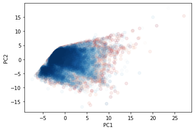

# Customer Segmentation Analysis


## Getting Started

1. Clone this repo [Github Pages](https://github.com/Dantarshi/projectcapstone).

2. Raw Data is being kept (raw_data_clusters.csv) within this repo.

3. main notebook link [Github Notebook](https://github.com/Dantarshi/projectcapstone/blob/master/Customer%20Segmentation%20Analysis.ipynb)


## Project Intro/Objective
The purpose of this project is to use customer purchase data to group customers based on their purchase behaviors and
to lay the foundation in the development of a business strategy that will create a target market and improve customer satisfaction. 


## Methods Used
* Inferential Statistics
* Machine Learning
* Data Visualization
* Predictive Modeling
* etc.

## Technologies 
* Python
* Seaborn
* Plotly Express
* Pandas, jupyter
* Scikit-learn
* ipywidget
* K-Means
* etc. 

## Project Description
This project performs analyses of customer purchase behaviors by revealing the clusters customers fall into and how these clusters interact with the company's shops.
The dataset used in the project is a city retail market data from an Italian distribution company called Coop. The dataset contains data aggregated from customers 
and information from the shops and pivoted to new columns made up of 40 features(coulumns) and 60366 instances(rows).
After importing the data from a csv file, I transformed the data into a dataframe and cleaned it using pandas. A couple of methods were used perform the analysis. 
* PCA for reduction of dimentionality by decomposing and tranforming the features into principal components (PC) and linear variance of the data.
* K-Means clustering is used to find the clusters, it is a fast algorithm mostly used fo customer segmentation especially for numerical data and it does well with large datasets.
* Random Forest Classification is used to train the dataset and identify the most important features.
* Plotly Express, Seaborn and Matplotlib for visualization in 3D.
            
## Needs of this project

- data exploration/descriptive statistics
- data processing/cleaning/Standardization
- statistical modeling
- machine learning modeling
- visualization
- writeup/reporting


Research Question: Are they any clusters of customers based on their purchase behavior? 

## Importing and cleaning data

Data for this project is gotten from bigml.com and imported into the notebook.


## Data cleaning

The cleaning of the data includes:
* Checking for null or missing data
* Getting information on data types
* Checking the data shapes
* Getting data summary
* Droping the null values(since there was only one row missing)
* Checking for duplicates
* Checking for place holders


## Pre-Processing
The pre-processing phase includes:
* Checking for categorical variables
* Droping customer ID (since it is redundant at this time)
* Standardizing the data


## Principal Component Analysis

I used Principal Component Analysis(PCA) to reduce the dimemtionality by decomposing and transforming the features into principal components and it did a terrific job of accounting for 98.61% of the variables.
The PCA visualization is shown below.


I made the first visualization of the PC1 and PC2 just to see how it will look like 
Visualize the first couple features (Exploratory Data Analysis)




## KMeans Clustering 

Finding best value for k in K-Means Clustering is shown below. 


Best k = 7

## Modeling

I performed an Interactive visualization for the best value of k(7) using 3-D and the figure below shows the beautiful distictive clusters. 


## Random Forest Classifier


I input the clusters as my target output to see the feature importances and trained the model using Random Forest Clasifier. It performed pretty well with these evaluation results.

```python
# Result for the evaluation
evaluate_model(y_test, y_hat_test)
```

                  precision    recall  f1-score   support
    
               0       0.96      0.94      0.95       144
               1       0.99      1.00      0.99      9393
               2       0.97      0.96      0.97      1389
               3       0.99      0.99      0.99      1249
               4       0.98      0.97      0.97       514
               5       0.98      0.97      0.98      2177
               6       0.99      0.96      0.98       226
    
        accuracy                           0.99     15092
       macro avg       0.98      0.97      0.98     15092
    weighted avg       0.99      0.99      0.99     15092

I went ahead to get the feature importance and it looked like this:


##  visualization


# Inference, Importance and Conclusion

### Inference

It shows amount of purchases, product purchases, average purchases and average price in individual shops. There are 7 clusters revealed from my 3-Dimensional visualization.

I noticed that distance to the shop have significant influence on the amount and quantity purchased by customers.

Also regardless the groups, customers spend more on the  Average in shop1 

### Importance

* These clusters are very important as they can help understand the make up customers based on the clusters they belong in. 
* Company can develop  specific business strategy to target these customers efficiently and  effectively. 
* They also can help in customer satisfaction and  retention.
* These strategies can come in ways of discounts, offers, deals etc. 
* It will also help the business minimize operational cost by allocating the most sought out goods to those shops that specifically have the demand for those goods.

# Conclusion

The customer segmentation analysis was directed towards understanding customer purchase behavior and the underlying factors that give rise to those behaviors.
I did several exploratory data analysis in both 2-Dimensions and 3-Dimensions to get the wholistic picture of the clusters.
I used PCA to decompose and transform the features to pricipal components and also determine the feature importance.
I also used K-Means clusters to detect the various clusters and ran a random forest clasification model to train and test the data. 
finally, I used the available data to answer the research question and offered insight to the business strategy that will not only satisfy and retain customers but also help in minimizing waste by allocating the right number of inventory to the right shop. 

